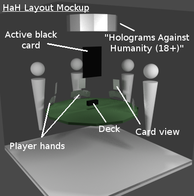

Holograms Against Humanity Use Cases
====================================

Use Case 1: Game Setup
----------------------

1. Each "installation" of the game should have some ID token appended to the target URL,
	uniquely identifying the game in play. E.g. `http://nodriftreality.com/HaH.html?gameId=deadb33f`

2. To start a new game, a player clicks on the *New Game* button (perhaps the marquee in the mockup?). 
	This reinitializes the game.

3. Each player then clicks on the deck at the center of the table to join in. They are dealt their full
	hands, and said cards appear on the table in front of them (using the event ray maybe). Alternatively,
	players may be arranged evenly around the circumference of the table.

	1. Players may join and leave at any point, but the game cannot continue with fewer than four players.

4. When all players have joined, the player that started the new game clicks the button again (changed to
	a *Start Game* button), and play begins.

Use Case 2: Game Play
---------------------

1. One player is assigned as judge by the server (random first round, sequential after that). That player is
	dealt a black card, and does not choose a card from their hand this round.

2. The judge acknowledges the black card by clicking on it, and it is displayed in the air above the play
	table. The card will face each player on their respective clients (using their saved position).

3. Non-judges browse through their hand by hovering their cursor over each card. When a card is viewed, it
	is pulled away from the other cards, and displayed larger. Possibly hovering over their table space? 
	Viewed cards only appear on their players' clients, and other clients cannot view the cards.

4. Non-judges select one to three cards from their hand (depending on the black card in play) by clicking
	on them. Once the correct number of cards have been selected, those cards animate from their hands to
	a pile in the middle, and new cards are dealt to their hands.

5. The judge is presented with the chosen cards from each player in the same way that players view their hands.

6. The judge chooses the winning card(s) by clicking on them. That card is displayed in the air above the table
	along with the black card, as a fanfare plays. Both cards then animate to the table in front of the winning
	player.

Use Case 3: Joining a Game in Progress
--------------------------------------

1. A new prospective player approaches the table, and clicks on the deck in the center of the table to join.

2. If the current player count is already at maximum, the request to join is denied and a message is displayed
	to the prospective player.

3. A prompt appears in the air above the table, saying that a new player is attempting to join. If any current
	player clicks "yes" on the prompt, the prompt disappears and the player is inserted into the turn order.

Use case 4: Deliberately Leaving a Game in Progress
---------------------------------------------------

1. A player clicks the "Leave Game" button.

2. They are removed from the turn order. If they were the judge, the round is aborted and the next round begins.

Use case 5: Kicking a Player from a Game in Progress
----------------------------------------------------

1. A player clicks on another player's "Kick Player" button.

2. A vote dialog appears in the air above the table for each player, asking if the proposed player should be kicked.

3. If a majority of players click "yes" on the dialog, that player is removed from the turn order. If they were the
	judge, the round is aborted and the next round begins.
